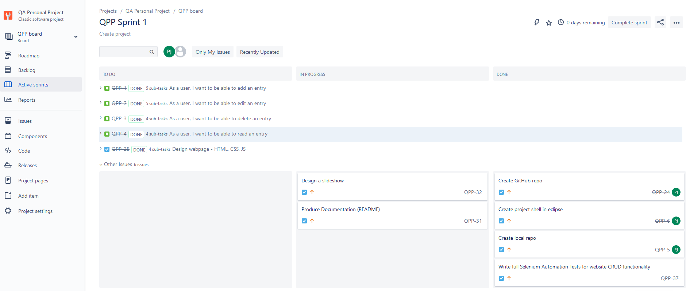
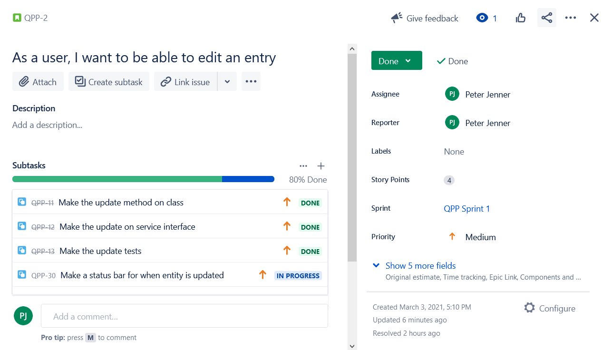
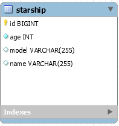
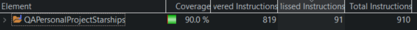
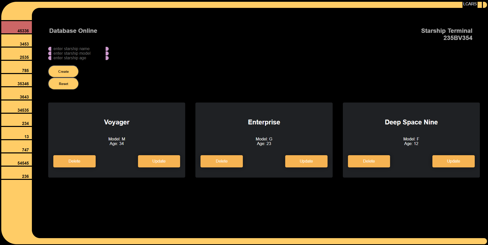
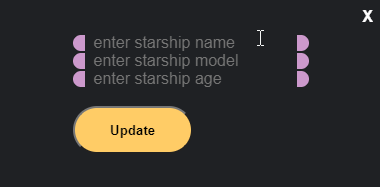

# QA Personal CRUD Project

This is the README for my first personal project with QA Academy training.

## Contents

- [Introduction](#Introduction)
- [Project Scope](#Project-Scope)
- [Technology Limitations](#Technology-Limitations)
- [Jira Board](#Jira-Board)
- [Database](#Database)
- [Back end](#Back-end)
- [Front end](#Front-end)
- [Testing](#Testing)
- [Design](#Design)
- [Areas for Improvememt](#Areas-for-Improvement)
- [Author and Acknowledgements](#Author-and-Acknowledgements)

## Introduction

This project entailed a fullstack approach to creating a web application. The spec for this project encaptulates the areas covered in the first five weeks of training, focusing on a CRUD application with fully functioning backend, frontend and API integration, with testing provided.

This README outlines the project and provides guidance on how to run this application, along with details on future improvements that could be made to this project.

## Project Scope

The scope of this project, including the MVP, is outlined below:

- Provide a Kanban style Jira board following the SCRUM methedology and applying Agile principles, outlining user stories and tasks. My Jira board can be found [here](https://pjennerqa.atlassian.net/secure/RapidBoard.jspa?rapidView=2&atlOrigin=eyJpIjoiNjhlYWMzNzI5YTliNDM5Njg4NDAyNTEyMWExMmNiYjciLCJwIjoiaiJ9) 

- Clear Documentation outlining the project, approaches taken and technology used. For this, I am utilising this README file.

- A relational database used for data persistence on the project, integrated with my application.

- A functioning application made using Java as the specified OOP language, following best practices.

- A functioning front-end website with a UI and API integration, allowing for user interaction.

- Test suit with maximum coverage, inclusive of integration, unit and automated testing, with a high level of acceptable coverage for the whole project.

- Code stored and fully integrated into a Version Control System to ensure security of the project.

## Technology Limitations

- Kanban Board: Jira
- Version Control: Git and Github
- Backend API: Java (Spring framework)
- Frontend languages: HTML, CSS, JavaScript
- Database: MySQL (persistent) / H2 database (testing)
- Test Suit: JUnit
- Automation Tests: Selenium
- IDE: Eclipse (backend) / Visual Studio Code (frontend) 

## Jira Board

My Kanban board for this project was creating using Jira software, utilising an Agile Scrum method to complete the user stories and tasks.

An example of a user story can be seen below, with subtasks given specific weightings

The Jira board was designed so that each task followed a logical flow and could be marked as completed, with the plan flowing through the completion requirements for the project. Tasks can be marked as 'to do', 'in progress' and finally marked as 'done' when completed.

## Database

Pictured below is an entity relationship diagram (ERD) for the database for my project. My project only takes one table into its scope, so there is no relationship diagram currently representing joins.

The database design utilised for this project included the H2 Console located locally for testing with a starship-data.sql script to automatically create case examples for testing. The persistent database is a MySQL database achieved using MySQL Workbench. 

## Back-end

The Github Repo for my Back-End can be found [here](https://github.com/PJenner/QA-Personal-Project-Starships)

The back-end is written in Java using the Spring Boot framework and Maven to manage dependencies, utilising the Eclipse IDE. Using Spring with Maven allows for fast testing of the application during coverage tests and convenient management of the dependencies required to run the application. 

Included in the back end are the Controller methods required to make the HTTP requests, as well as the logic which links the application to the database. The code has been written following SOLID principles with a focus on using interfaces that can be easily changed if required in the future.

## Front-end

The Github Repo for my Front-End can be found [here](https://github.com/PJenner/QA-Personal-Project-Starships-FrontEnd)

The front-end of the application is written in HTML, CSS and JavaScript using the Visual Studio Code IDE. 

Similar to Bootstrap for styling, the main frame of the project was based on the LCARS open source project that is free to use as per the usage policy. The project can be found [here](https://github.com/joernweissenborn/lcars). 
As per the agreement in the license file from the provided project, the license file has been included in both the front end and back end repositories of my project for full transparency.

The CSS rules from the LCARS framework have been customised by myself to achieve the results desired with original new CSS added to it.

JavaScript is used to get data from the back-end for all CRUD functionality.

## Testing

The testing was achieved using JUnit Suite with MockMvc for Integration Testing to ensure the methods perform as designed, mocking the HTTP requests to test the full functionality of the backend, running against a H2 Console database to avoid polluting the persistent data and to ensure the tests target consistent data. With each run, the H2 database is dropped and created again.

Mockito for Unit testing to mock method call and ensure they are performing as expected.

Selenium with JUnit for Automation Testing to ensure the CRUD application functions perform correctly on Chrome. This also utilises the H2 Console database, populating it and dropping the table with each test run for consistency. 

The total coverage for back-end came to 90.0%. Coverage for the test folder is 100%.

As the front-end files are not included in the static folder, it is necessary to launch the front-end server to perform the testing.

## Design

The design of the front-end is styled on the LCARs visual database style from a popular Sci-Fi Tv show. It mimics a database where Starships can be added to the database, updated and deleted by the user. Below is a screenshot of my front-end webpage:

Please find below a screenshot of the modal for the front-end visible when a user selects the update button.

## Areas for Improvement

The aim of this project was to achieve all of the specifications, being conscious of MVP aims. If more time was available for improvements, there are a few areas I would like add:

- Add a notification for when a user creates or updates a Starship to ensure it's clear it was successful.
- Add a Search feature to identify a record
- Add sound effects upon button press

## Author and Acknowledgements

I'd like to thank the QA trainers for assisting in the completion of this project and their excellent training.

Special thanks to my family for their ongoing support, as always.

Thanks to God!

Project by Peter Jenner

